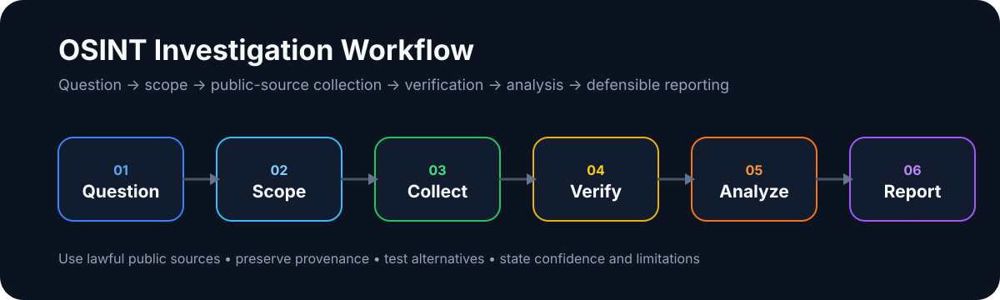

# 🕵️ خارطة طريق OSINT

## دليل عملي وأخلاقي للاستخبارات مفتوحة المصدر

<div align="center">


**خارطة طريق عربية لتعلّم OSINT من الصفر حتى المستوى الاحترافي**
**بحث • تحقق • تحليل • توثيق • تقرير**

</div>

---

## 📌 نبذة عن الدليل

هذا الدليل هو خارطة طريق عملية لتعلّم **الاستخبارات مفتوحة المصدر (OSINT)** بطريقة منظمة، قانونية، وأخلاقية.

الهدف ليس جمع أكبر عدد من الأدوات، بل بناء طريقة تفكير صحيحة تساعدك على:

* فهم ما هو OSINT فعلاً
* البحث في المصادر العامة بطريقة منظمة
* التحقق من صحة المعلومات
* تحليل الأدلة وربطها بالسياق
* كتابة تقارير واضحة وقابلة للدفاع عنها
* الالتزام بالقانون والخصوصية والأخلاقيات

> OSINT ليس “معرفة كل شيء”، بل معرفة ما يمكن إثباته بالأدلة وما لا يمكن إثباته.

---

## 🌐 اللغات

* [English](README.en.md)
* [العربية](README.ar.md)
* [Türkçe](README.tr.md)

---

## 📌 فهرس المحتويات

* [ما هو OSINT؟](#-ما-هو-osint)
* [OSINT مقابل الاختراق](#-osint-مقابل-الاختراق)
* [لمن هذا الدليل؟](#-لمن-هذا-الدليل)
* [خارطة التعلم](#-خارطة-التعلم)
* [المرحلة الأولى: الأساسيات](#-المرحلة-1--الأساسيات)
* [المرحلة الثانية: المهارات الأساسية](#-المرحلة-2--المهارات-الأساسية)
* [المرحلة الثالثة: OSINT المتقدم](#-المرحلة-3--osint-المتقدم)
* [سير عمل OSINT](#-سير-عمل-osint)
* [أنواع مصادر OSINT](#-أنواع-مصادر-osint)
* [الأدوات والأطر](#-الأدوات-والأطر)
* [قائمة تحقق للتحقيق](#-قائمة-تحقق-للتحقيق)
* [دراسة حالة](#-دراسة-حالة)
* [التقارير والتوثيق](#-التقارير-والتوثيق)
* [أخطاء شائعة](#-أخطاء-شائعة)
* [مصادر التعلم](#-مصادر-التعلم)
* [كتب مقترحة](#-كتب-مقترحة)
* [الشهادات والمسار المهني](#-الشهادات-والمسار-المهني)
* [الأخلاقيات والمسؤولية القانونية](#-الأخلاقيات-والمسؤولية-القانونية)
* [المساهمة](#-المساهمة)
* [الترخيص](#-الترخيص)

---

## 🔍 ما هو OSINT؟

**OSINT** اختصار لـ **Open Source Intelligence**، أي الاستخبارات المبنية على المصادر المفتوحة.

هو عملية منظمة تشمل:

> جمع المعلومات المتاحة للعامة،
> التحقق من صحتها،
> تحليلها،
> ثم تقديمها في تقرير واضح
> للإجابة على سؤال محدد.

OSINT لا يعني البحث العشوائي أو ملاحقة الأشخاص.
القيمة الحقيقية في OSINT تأتي من **المنهجية، التحقق، والتوثيق**.

تشمل المصادر المفتوحة:

* المواقع الإلكترونية والمدونات
* محركات البحث
* الصحف والمقالات العامة
* قواعد البيانات العامة
* منصات التواصل الاجتماعي العامة
* الصور والفيديوهات المنشورة للعامة
* الخرائط وصور الأقمار الصناعية
* سجلات النطاقات و DNS
* أرشيف الويب
* المستندات العامة
* بيانات الشركات والمؤسسات المتاحة قانونياً

---

## ⚖️ OSINT مقابل الاختراق


> **OSINT يعتمد على الملاحظة والتحليل، وليس على التسلل أو الاختراق.**

| OSINT قانوني         | اختراق غير قانوني               |
| -------------------- | ------------------------------- |
| استخدام معلومات عامة | الوصول إلى حسابات أو أنظمة خاصة |
| بحث وتحليل سلبي      | استغلال ثغرات أو تنفيذ هجمات    |
| لا يوجد تجاوز حماية  | تجاوز تسجيل دخول أو كلمات مرور  |
| توثيق وشفافية        | إخفاء هوية بهدف الضرر           |
| احترام الخصوصية      | انتهاك الخصوصية                 |

❌ إذا كانت المعلومة تتطلب:

* تجاوز تسجيل الدخول
* استخدام حسابات وهمية لخداع الآخرين
* استغلال ثغرات
* تخمين كلمات مرور
* خرق شروط الاستخدام
* الوصول لبيانات خاصة

➡️ فهذا **ليس OSINT أخلاقيًا**.

---

## 🎯 لمن هذا الدليل؟

هذا الدليل مناسب لـ:

* المبتدئين في الأمن السيبراني
* طلاب التحليل الجنائي الرقمي
* المهتمين باستخبارات التهديدات
* الصحفيين ومدققي المعلومات
* الباحثين والمحققين
* محللي SOC و CTI
* مسؤولي التوعية الأمنية
* أي شخص يريد تعلم OSINT بشكل قانوني ومنهجي

لا تحتاج خبرة مسبقة، لكنك تحتاج إلى:

* صبر
* دقة
* فضول منظم
* احترام للخصوصية
* قدرة على التوثيق والتحقق

---

## 🧭 خارطة التعلم

```text
مبتدئ
  ↓
أساسيات البحث والتحقق
  ↓
مصادر عامة + توثيق
  ↓
SOCMINT / GEOINT / WEBINT
  ↓
تحليل وربط علاقات
  ↓
تقارير احترافية
  ↓
تخصص مهني في OSINT أو CTI أو Digital Forensics
```

---

## 🟢 المرحلة 1 – الأساسيات


### الهدف

بناء أساس صحيح قبل استخدام الأدوات.

### المحاور

* معنى OSINT
* الفرق بين المعلومات والاستخبارات
* الفرق بين الدليل والاستنتاج
* حدود القانون والخصوصية
* أساسيات OPSEC
* تقييم المصادر
* التحيزات المعرفية
* كتابة الملاحظات
* حفظ الأدلة بطريقة منظمة

### مهارات يجب إتقانها

* البحث بكلمات مفتاحية دقيقة
* استخدام محركات بحث مختلفة
* تمييز المصدر الأصلي من الناقل
* حفظ الروابط والتواريخ
* عدم بناء استنتاج من دليل واحد فقط

### قاعدة مهمة

```text
لا تبدأ بالأدوات.
ابدأ بالسؤال، النطاق، والمنهجية.
```

---

## 🟡 المرحلة 2 – المهارات الأساسية


### 1. البحث المتقدم

تعلم كيفية البحث بدقة باستخدام:

* Boolean Operators
* Google Dorks
* البحث داخل مواقع محددة
* البحث عن ملفات PDF و DOCX
* البحث في العناوين
* البحث في أرشيف الصفحات

أمثلة:

```text
site:example.com filetype:pdf
intitle:"report" "company name"
"username" -pinterest -facebook
```

---

### 2. استخبارات التواصل الاجتماعي SOCMINT

تركز على تحليل المحتوى العام في منصات التواصل.

المهارات:

* ربط أسماء المستخدمين
* فهم الأنماط الزمنية للنشر
* تحليل الصور العامة
* ربط الحسابات المتشابهة بحذر
* عدم اعتبار تشابه الاسم دليلاً قاطعاً

تنبيه:

```text
تشابه اسم المستخدم لا يثبت الملكية.
يجب دعم الاستنتاج بأدلة متعددة.
```

---

### 3. التحقق من الصور والفيديو

المهارات الأساسية:

* البحث العكسي عن الصور
* فحص المعالم الظاهرة
* مقارنة الخرائط
* تحليل الظلال
* فهم البيانات الوصفية Metadata
* مراجعة تاريخ أول ظهور للصورة أو الفيديو

أدوات مفيدة:

* Google Images
* Yandex Images
* TinEye
* InVID
* SunCalc
* Google Earth
* OpenStreetMap

---

### 4. النطاقات والبنية التحتية

تركز على المعلومات العامة حول المواقع والخدمات.

المهارات:

* WHOIS
* DNS Records
* Subdomains
* Certificate Transparency
* Web technologies
* أرشيف الموقع
* سجلات عامة للشركات

تنبيه:

```text
التحليل السلبي مقبول.
الفحص النشط بدون إذن ليس OSINT آمنًا.
```

---

### 5. ربط العلاقات

يهدف إلى فهم العلاقات بين:

* أشخاص
* حسابات
* نطاقات
* شركات
* مواقع
* بريد إلكتروني
* صور
* أحداث

لكن يجب الحذر من الاستنتاجات الضعيفة.

مثال:

```text
نفس الاسم + نفس الصورة + نفس البريد العام = مؤشر قوي
نفس الاسم فقط = مؤشر ضعيف
```

---

## 🔴 المرحلة 3 – OSINT المتقدم

### التركيز

* المنهجية قبل الأدوات
* التحقق عبر مصادر مستقلة
* بناء فرضيات واختبارها
* كتابة تقارير مهنية
* تقييم الثقة
* حماية الباحث والمصادر
* إدارة الأدلة

### محاور متقدمة

* Priority Intelligence Requirements - PIR
* Hypothesis Testing
* Confidence Assessment
* Link Analysis
* GEOINT
* SOCMINT
* WEBINT
* CTI OSINT
* Breach Data Awareness
* Dark Web Awareness بدون دخول غير قانوني
* Evidence Preservation
* Chain of Custody basics

---

## 🔁 سير عمل OSINT



```text
1. تحديد الهدف
2. تحديد النطاق
3. اختيار المصادر العامة
4. جمع المعلومات
5. حفظ الأدلة
6. التحقق من المصادر
7. تحليل النتائج
8. تقييم مستوى الثقة
9. كتابة التقرير
10. مراجعة القيود
```

---

## 🧩 أنواع مصادر OSINT

| النوع          | أمثلة                                     |
| -------------- | ----------------------------------------- |
| WEBINT         | مواقع، مدونات، صفحات شركات                |
| SOCMINT        | حسابات عامة، منشورات، تفاعلات             |
| GEOINT         | خرائط، صور أقمار صناعية، مواقع            |
| IMINT          | صور وفيديوهات                             |
| FININT         | سجلات مالية عامة، شركات، معاملات عامة     |
| TECHINT        | نطاقات، DNS، شهادات TLS                   |
| Academic OSINT | أبحاث، أوراق علمية، قواعد بيانات أكاديمية |
| Public Records | سجلات حكومية وقانونية متاحة للعامة        |

---

## 🧰 الأدوات والأطر

> الأدوات تساعدك على العمل، لكنها لا تفكر بدلاً عنك.

### أطر عامة

* OSINT Framework
  https://osintframework.com/

* Bellingcat Resources
  https://www.bellingcat.com/category/resources/

* Awesome OSINT
  https://github.com/jivoi/awesome-osint

* Start.me OSINT Collections
  https://start.me/

---

### البحث ومحركات البحث

* Google Advanced Search
  https://www.google.com/advanced_search

* DuckDuckGo
  https://duckduckgo.com/

* Bing
  https://www.bing.com/

* Yandex
  https://yandex.com/

* Brave Search
  https://search.brave.com/

---

### أرشفة الويب

* Internet Archive
  https://archive.org/web/

* Archive.today
  https://archive.today/

* Perma.cc
  https://perma.cc/

* Webrecorder
  https://webrecorder.net/

---

### أسماء المستخدمين والحسابات العامة

* WhatsMyName
  https://whatsmyname.app/

* Namechk
  https://namechk.com/

* Sherlock
  https://github.com/sherlock-project/sherlock

* Maigret
  https://github.com/soxoj/maigret

---

### الصور والفيديو

* Google Images
  https://images.google.com/

* Yandex Images
  https://yandex.com/images/

* TinEye
  https://tineye.com/

* InVID Verification Plugin
  https://www.invid-project.eu/tools-and-services/invid-verification-plugin/

* FotoForensics
  https://fotoforensics.com/

---

### الخرائط وتحديد المواقع

* Google Earth
  https://earth.google.com/

* OpenStreetMap
  https://www.openstreetmap.org/

* SunCalc
  https://www.suncalc.org/

* GeoHack
  https://geohack.toolforge.org/

* Wikimapia
  https://wikimapia.org/

---

### النطاقات والبنية التحتية

* WHOIS
  https://who.is/

* SecurityTrails
  https://securitytrails.com/

* Shodan
  https://www.shodan.io/

* Censys
  https://search.censys.io/

* crt.sh
  https://crt.sh/

* DNSDumpster
  https://dnsdumpster.com/

* BuiltWith
  https://builtwith.com/

* Wappalyzer
  https://www.wappalyzer.com/

---

### تحليل البيانات والتوثيق

* CyberChef
  https://gchq.github.io/CyberChef/

* Maltego
  https://www.maltego.com/

* Obsidian
  https://obsidian.md/

* Zotero
  https://www.zotero.org/

* Draw.io
  https://app.diagrams.net/

---

## ✅ قائمة تحقق للتحقيق

استخدم هذه القائمة قبل وأثناء أي تحقيق OSINT:

```text
[ ] ما هو السؤال الذي أحاول الإجابة عليه؟
[ ] ما هو النطاق المسموح؟
[ ] هل كل المصادر عامة؟
[ ] هل جمعت أكثر من مصدر؟
[ ] هل حفظت الروابط والتاريخ؟
[ ] هل ميّزت بين الحقيقة والاستنتاج؟
[ ] هل هناك احتمال تحيز؟
[ ] هل يوجد دليل مضاد؟
[ ] هل التقرير يذكر القيود؟
[ ] هل احترمت الخصوصية والقانون؟
```

---

## 📍 دراسة حالة

**السيناريو:** التحقق من موقع فيديو متداول على الإنترنت.

### الهدف

معرفة ما إذا كان الفيديو فعلاً في المكان المذكور.

### الخطوات

1. استخراج لقطات واضحة من الفيديو.
2. البحث عن الصورة عكسيًا.
3. تحديد المعالم الظاهرة.
4. مقارنة المعالم مع الخرائط.
5. استخدام صور الأقمار الصناعية.
6. تحليل الظلال عبر SunCalc.
7. مقارنة الطقس والتاريخ.
8. البحث عن مصادر مستقلة.
9. كتابة النتيجة مع مستوى الثقة.

### النتيجة

```text
الموقع: مؤكد بدرجة ثقة عالية
التوقيت: غير مؤكد
السبب: الظلال والطقس لا يطابقان الادعاء بشكل كامل
```

---

## 📝 التقارير والتوثيق

تقرير OSINT الجيد يجب أن يكون واضحًا، هادئًا، ومبنيًا على الأدلة.

### هيكل تقرير بسيط

```text
1. العنوان
2. الهدف
3. النطاق
4. المنهجية
5. المصادر
6. الأدلة
7. التحليل
8. مستوى الثقة
9. القيود
10. الخلاصة
```

### مثال صياغة نتيجة

```text
النتيجة:
يوجد تشابه بين حسابين عامين من حيث اسم المستخدم والصورة الشخصية.

الأدلة:
- المصدر الأول: رابط + تاريخ الوصول
- المصدر الثاني: رابط + تاريخ الوصول

مستوى الثقة:
متوسط

القيود:
لا يوجد دليل مباشر يثبت أن الحسابين يعودان لنفس الشخص.
```

---

## 📊 مستويات الثقة

| المستوى | المعنى                                   |
| ------- | ---------------------------------------- |
| منخفض   | دليل واحد أو مصدر ضعيف                   |
| متوسط   | أكثر من مصدر لكن يوجد نقص أو احتمال بديل |
| عالٍ    | مصادر مستقلة ومتناسقة                    |
| مؤكد    | أدلة قوية ومباشرة وقابلة للتحقق          |

---

## ❌ أخطاء شائعة

* البدء بالأدوات قبل تحديد الهدف
* الاعتماد على مصدر واحد
* الخلط بين التشابه والإثبات
* تجاهل الأدلة المخالفة
* ضعف التوثيق
* سوء استخدام الصور والفيديو
* نسيان تاريخ الوصول للمصادر
* استخدام OSINT كمبرر للتطفل
* إهمال OPSEC
* كتابة تقرير مليء بالاستنتاجات دون أدلة

---

## 📚 مصادر التعلم

### مصادر مجانية

* Bellingcat Resources
  https://www.bellingcat.com/category/resources/

* OSINT Framework
  https://osintframework.com/

* OSINTCurious
  https://osintcurio.us/

* FreeOSINT
  https://freeosint.github.io/

* Google Search Help
  https://support.google.com/websearch/

* GIJN Investigative Tools
  https://gijn.org/resource/

* Verification Handbook — متوفر بالعربية والتركية
  https://verificationhandbook.com/

---

## 📘 كتب مقترحة

### للمبتدئين والمتوسطين

* **Open Source Intelligence Techniques**
  Michael Bazzell
  مناسب جدًا لفهم الأدوات، بيئات العمل، التوثيق، والبحث العملي.

* **Open Source Intelligence Methods and Tools**
  Nihad A. Hassan & Rami Hijazi
  كتاب عملي يشرح مصادر OSINT وأساليب البحث والتحليل.

* **We Are Bellingcat**
  Eliot Higgins
  كتاب ممتاز لفهم التفكير التحقيقي والتحقق من الأدلة المفتوحة.

---

### للصحافة والتحقق الرقمي

* **Digital Witness**
  Sam Dubberley, Alexa Koenig, Daragh Murray
  مناسب لفهم الأدلة الرقمية، التوثيق، والتحقق في سياقات حقوقية وصحفية.

* **Verification Handbook**
  European Journalism Centre
  مرجع مفيد للتحقق من المحتوى الرقمي والمعلومات المتداولة.

---

## 🎓 الشهادات والمسار المهني

### شهادات ومصادر تدريب

* Basel Institute LEARN
  https://learn.baselgovernance.org/

* Security Blue Team
  https://securityblue.team/

* GIAC GOSI
  https://www.giac.org/certifications/open-source-intelligence-gosi/

* SANS SEC497
  https://www.sans.org/cyber-security-courses/practical-open-source-intelligence/

---

### مسارات مهنية مرتبطة بـ OSINT

* محلل استخبارات تهديدات CTI
* محلل SOC
* محقق جنائي رقمي
* محلل احتيال
* باحث أمن سيبراني
* صحفي استقصائي
* محلل مخاطر شركات
* باحث في الأمن والخصوصية
* محلل حماية علامة تجارية

---

## 🛡️ OPSEC للباحث

قبل بدء أي تحقيق:

* افصل حساباتك الشخصية عن بيئة البحث.
* استخدم متصفحًا مخصصًا للتحقيق.
* لا تسجل الدخول بحساباتك الشخصية أثناء البحث.
* لا تضغط روابط مشبوهة بدون عزل مناسب.
* لا تحفظ أدلة حساسة في أماكن عامة.
* لا تنشر نتائج غير مؤكدة.
* لا تتواصل مع الهدف بدون إذن أو ضرورة قانونية واضحة.

---

## ⚖️ الأخلاقيات والمسؤولية القانونية

### المسموح

* جمع بيانات عامة
* أرشفة قانونية
* تحليل يحترم الخصوصية
* التحقق من ادعاءات عامة
* دراسة نطاقات ومواقع من مصادر عامة
* كتابة تقارير مهنية دون تشهير

### الممنوع

* الهندسة الاجتماعية
* Doxxing
* انتحال شخصية
* فحص نشط بدون إذن
* تجاوز حماية
* نشر بيانات شخصية حساسة
* ملاحقة أو مضايقة الأشخاص
* استخدام النتائج للابتزاز أو الضرر

> المصداقية في OSINT تُبنى على الانضباط، لا على التوسع.

---

---

## 🤝 المساهمة

المساهمات مرحب بها.

يمكنك المساعدة عبر:

* تحديث الروابط القديمة
* إضافة مصادر تعلم جديدة
* تحسين الترجمة العربية أو التركية أو الإنجليزية
* إضافة أدوات جديدة مع شرح استخدامها
* إضافة دراسات حالة قانونية
* تحسين التصميم والصور
* إضافة قوالب تقارير

طريقة المساهمة:

```text
Fork → Create Branch → Make Changes → Open Pull Request
```

---

## 📄 الترخيص

MIT License © Imed Kablavi

---

## 🧠 ملاحظة أخيرة

OSINT ليس سباقًا لجمع أكبر كمية من المعلومات.

هو عمل تحليلي منظم يبدأ بسؤال واضح، ويعتمد على مصادر قانونية، ويتطلب تحققًا دقيقًا، وينتهي بتقرير مسؤول يمكن الدفاع عنه.
