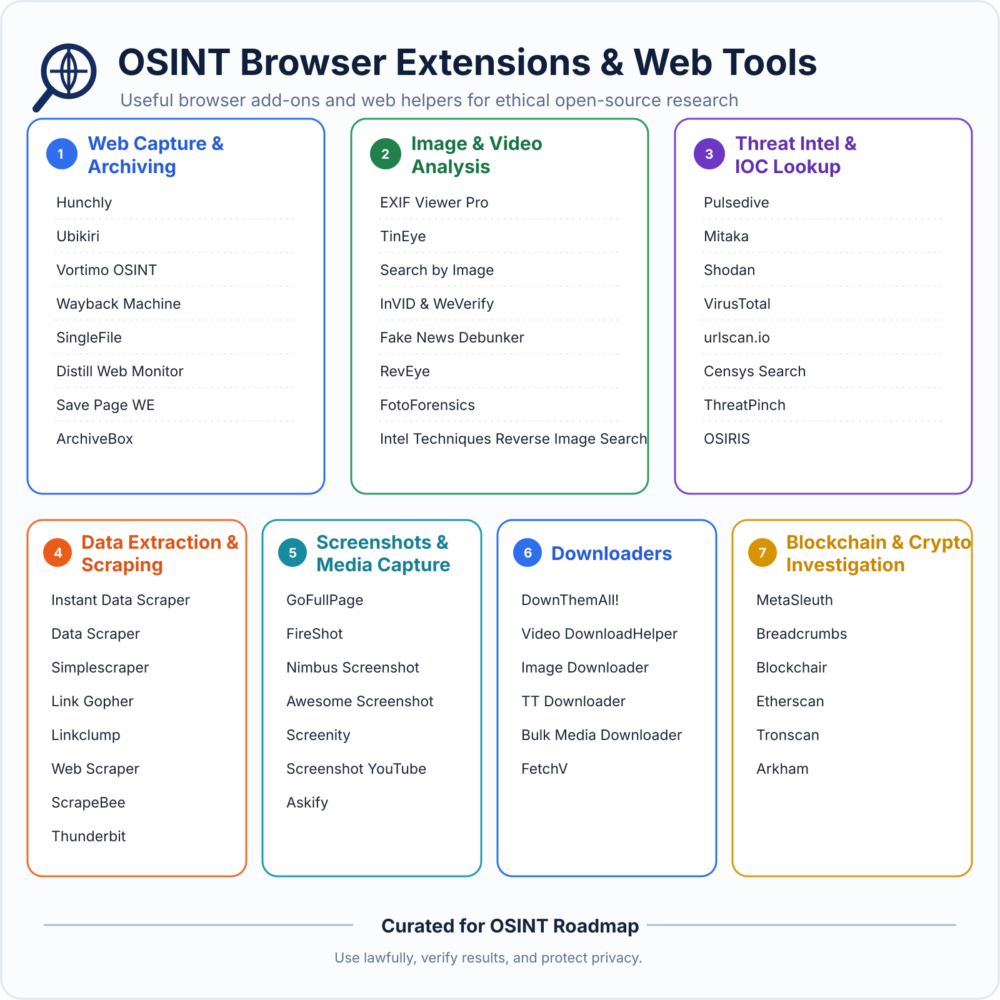

# 🕵️ OSINT Roadmap

> A practical, multilingual roadmap for learning Open Source Intelligence through research, verification, analysis, documentation, and hands-on practice.

[](LICENSE)


[](https://github.com/imedkablavi/OSINT-Roadmap/actions/workflows/link-check.yml)
[](https://github.com/imedkablavi/OSINT-Roadmap/actions/workflows/accessibility.yml)
[](https://github.com/imedkablavi/OSINT-Roadmap/actions/workflows/lighthouse.yml)
[](https://github.com/imedkablavi/OSINT-Roadmap/actions/workflows/tool-freshness.yml)

A roadmap should tell you more than which tools exist. It should tell you **what question to ask, what evidence is strong enough, what can go wrong, and what to do next**.

This repository is built around that idea.

## ⚡ Try the interactive project

**[Launch the OSINT Tool Finder →](https://imedkablavi.github.io/OSINT-Roadmap/tool-finder.html)**  
Filter 80+ curated tools by the clue you already have: domain, username, image, IP, company, location, document, aircraft, vessel, crypto address, cost and skill level.

**[Search the entire OSINT Roadmap →](https://imedkablavi.github.io/OSINT-Roadmap/search.html)**  
Search guides, playbooks, labs, glossaries, case studies and multilingual documentation from one static privacy-friendly index.

> The interactive links become live as soon as GitHub Pages is enabled for this repository.

## 🌐 Choose your language

### 🇬🇧 English

**[Open the English Roadmap →](README.en.md)**

Core material:

- [Research methods](docs/research-methods.md)
- [Tool matrix](docs/tool-matrix.md)
- [Curated OSINT Tool Library](tools/tool-library.md)
- [Practice labs](docs/practice-labs.md)
- [Browser extensions & web tools](tools/browser-extensions.md)
- [Report template](docs/report-template.md)
- [English glossary](glossary/README.en.md)

### 🇸🇦 العربية

**[افتح خارطة الطريق العربية →](README.ar.md)**

- [مركز التعلم العربي](docs/ar/README.md)
- [مكتبة أدوات OSINT بالعربية](tools/tool-library.ar.md)
- [إضافات المتصفح وأدوات الويب](tools/browser-extensions.ar.md)
- [المسارات الاحترافية بالعربية](docs/ar/advanced-paths.md)
- [قاموس OSINT بالعربية](glossary/README.ar.md)

### 🇹🇷 Türkçe

**[Türkçe OSINT Yol Haritasını Aç →](README.tr.md)**

- [Türkçe öğrenme merkezi](docs/tr/README.md)
- [Türkçe OSINT Araç Kütüphanesi](tools/tool-library.tr.md)
- [Tarayıcı eklentileri & web araçları](tools/browser-extensions.tr.md)
- [Profesyonel uzmanlaşma yolları](docs/tr/advanced-paths.md)
- [Türkçe OSINT sözlüğü](glossary/README.tr.md)

---

## 🔎 OSINT Tool Library & Tool Finder

The project now maintains a **curated library of 80+ tools and learning resources** instead of an unreviewed link dump.

The library covers:

- search, archives and monitoring;
- usernames and public identity clues;
- image and video verification;
- GEOINT, maps and satellite imagery;
- domains, IPs and internet infrastructure;
- CTI and public IOC enrichment;
- company, ownership and public records;
- aviation and maritime research;
- document extraction and data cleanup;
- investigation workspaces and relationship analysis;
- blockchain research.

Every category records the **input, cost, skill level, best use and main limitation** of a tool. The interactive catalogue also displays a **last-reviewed date for every tool**, with per-tool overrides as individual resources are re-checked.

- [English Tool Library](tools/tool-library.md)
- [مكتبة الأدوات بالعربية](tools/tool-library.ar.md)
- [Türkçe Araç Kütüphanesi](tools/tool-library.tr.md)
- [Tools Hub](tools/README.md)
- [Interactive Tool Finder](https://imedkablavi.github.io/OSINT-Roadmap/tool-finder.html)
- [Full-content search](https://imedkablavi.github.io/OSINT-Roadmap/search.html)

The Tool Finder lets you filter tools by inputs such as `Domain`, `Username`, `Image`, `IP`, `Organization`, `Location`, `Document`, `Aircraft`, `Vessel` or `Crypto Address`, as well as cost and skill level.

## 🧰 Browser extensions & web tools



The repository includes a separate browser-tool guide for extensions and web helpers where permissions and privacy matter.

- [English guide](tools/browser-extensions.md)
- [الدليل العربي](tools/browser-extensions.ar.md)
- [Türkçe rehber](tools/browser-extensions.tr.md)

The guide covers web capture and archiving, image/video verification, threat-intelligence lookups, data extraction, screenshots, download helpers and blockchain research. It also explains extension permissions, privacy risks, research-browser separation, and what each category **does not prove**.

## 📡 Tool Radar & project updates

Tools change ownership, pricing, permissions and interfaces. A useful OSINT project needs a maintenance loop, not a one-time list.

- [OSINT Tool Radar — August 2026](updates/2026-08-tool-radar.md)
- [Updates archive](updates/README.md)
- RSS feed after Pages is enabled: `https://imedkablavi.github.io/OSINT-Roadmap/feed.xml`

Tool Radar notes document what changed, why it matters and what researchers should do differently. A separate weekly **Tool Freshness** workflow checks review age even when a URL still works, so stale catalogue entries are detected independently of broken-link checks.

## 🗺️ Visual roadmap

**[Open the interactive GitHub-rendered roadmap →](docs/visual-roadmap.md)**

```text
Foundations
    ↓
Discovery
    ↓
Verification
    ↓
Analysis
    ↓
Reporting
    ↓
Specialization
    ↓
Portfolio + Review
```

The roadmap is method-first because tools change much faster than good investigation practice.

## 🎯 Professional specialization tracks

Once the core workflow is comfortable, move into a track instead of collecting random advanced tools.

| Track | What you learn |
| --- | --- |
| [Cyber Threat Intelligence](tracks/cti.md) | PIRs, passive indicator enrichment, infrastructure relationships, ATT&CK mapping, timelines, attribution discipline |
| [Digital Footprint Investigation](tracks/digital-footprint.md) | public trace discovery, archive history, stable identifiers, attribution, privacy minimization |
| [Company Investigation](tracks/company-investigation.md) | legal entity resolution, filings, ownership, corporate timelines, sanctions checks, relationship mapping |
| [Advanced GEOINT Challenges](challenges/advanced-geoint.md) | a 10-level geolocation/chronolocation challenge ladder with a scoring rubric |

Arabic and Turkish learners also have localized specialization hubs:

- [المسارات الاحترافية بالعربية](docs/ar/advanced-paths.md)
- [Türkçe profesyonel uzmanlaşma yolları](docs/tr/advanced-paths.md)

## 🧭 Investigation playbooks

Sometimes you do not need another chapter. You need to know what to do with the clue already in front of you.

**[Open the Investigation Playbooks →](playbooks/README.md)**

Playbooks cover:

- I have a domain
- I have a username
- I have an image
- I have a video
- I have a company name
- I have an IP address
- I have a public document
- I have a news claim
- I have a location claim

Every playbook includes verification questions and stop conditions.

## 🧪 Practice that produces evidence of skill

The repository uses an artifact-based learning model:

```text
Do not mark a skill complete because you read about it.
Mark it complete when you can produce and defend the work.
```

- [Practice labs](docs/practice-labs.md)
- [Advanced GEOINT challenge ladder](challenges/advanced-geoint.md)
- [Skill Matrix & Progress Tracker](docs/skill-matrix.md)
- [Real-world case-study lessons](case-studies/README.md)

The skill matrix ranges from **L0 — Unfamiliar** to **L4 — Mentor** and requires a practical artifact for progression.

## ⚡ Field reference

Need a fast reminder while working?

**[OSINT Quick Reference / Cheat Sheet →](cheatsheets/osint-quick-reference.md)**

It covers search patterns, source verification, image/video checks, username attribution, passive domain research, company research, timelines, confidence language, evidence tables, reporting, and stop rules.

## 📖 OSINT glossary in three languages

- [English](glossary/README.en.md)
- [العربية](glossary/README.ar.md)
- [Türkçe](glossary/README.tr.md)

The glossary covers methodology terms as well as technical concepts such as provenance, corroboration, attribution, chronolocation, passive DNS, Certificate Transparency, entity resolution, source dependency, and stop conditions.

## 🔬 What makes this roadmap different?

The project is deliberately not a directory of thousands of links.

It teaches:

- how to frame an intelligence question;
- how to distinguish discovery from verification;
- how to trace information back to its source;
- how to identify copied-source chains;
- how to challenge the first hypothesis;
- how to calibrate attribution and confidence;
- how to document what a tool **cannot** prove;
- how to stop collecting when additional data adds no analytical value;
- how to use AI for assistance without treating model output as evidence;
- how to produce reports another researcher can reproduce.

```text
Finding information is discovery.
Proving what it means is investigation.
```

## 🤖 AI-assisted OSINT

AI can be useful for:

- generating search-query variants;
- transliteration and language discovery;
- entity extraction from your own collected material;
- organizing notes;
- suggesting alternative hypotheses;
- cleaning structured data.

But:

```text
AI may suggest the next question.
A verifiable source must support the answer.
```

Names, dates, quotations, relationships, URLs, and conclusions still need verification against underlying sources.

## 🛡️ Scope and ethics

This project focuses on lawful public-source research.

It does not teach:

- unauthorized access;
- credential attacks;
- account takeover;
- access-control bypass;
- deceptive social engineering;
- stalking or harassment;
- doxxing;
- intrusive scanning without authorization.

A practical stop rule:

```text
If the next step requires intrusion, deception, private access,
or bypassing a security restriction, stop.
```

## 🔧 Repository quality

The project is tested automatically with GitHub Actions:

- link health across Markdown and the static site;
- HTML standards validation;
- Chromium E2E tests for Tool Finder and full-content search;
- WCAG A/AA accessibility scans;
- Lighthouse performance, accessibility, best-practices and SEO budgets;
- Pages artifact and deployment smoke tests;
- structured tool-catalogue validation;
- weekly stale-tool review-age detection independent of broken links.

Most checks run on relevant pull requests and after changes land on `main`; link/freshness maintenance also runs on schedules.

## 🤝 Contributing

Corrections and contributions are welcome, especially:

- better primary sources;
- new safe practice labs;
- regional public-record guides;
- improved translations;
- new investigation playbooks;
- visual-verification methods;
- stale-link and stale-tool fixes;
- clearer explanations of what a tool can and cannot prove.

See [CONTRIBUTING.md](CONTRIBUTING.md).

## License

MIT License © Imed Kablavi

---

If the project is useful, a ⭐ helps more students, researchers, journalists, and security learners discover it.