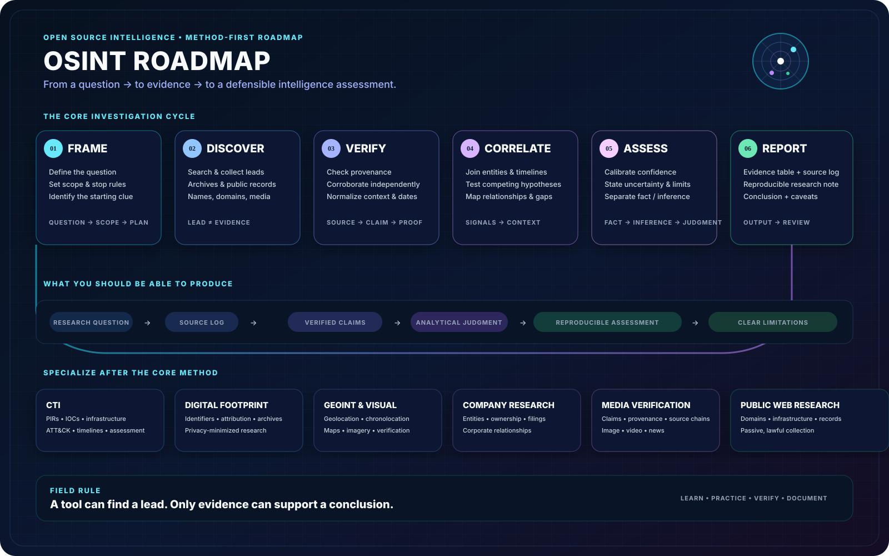

# OSINT Roadmap

**A practical roadmap for learning Open Source Intelligence through research, verification, analysis, and clear reporting.**

> **Good OSINT is not about collecting the most information.**
> It is about asking a useful question, finding relevant public sources, testing what they tell you, and being honest about what they do not establish.

---

## The Roadmap

This roadmap is built around a simple idea: methods last longer than tools.

A service can disappear, change ownership, change pricing, or change how its data is presented. The habits that make an investigation reliable are much more stable.

The core workflow is:

~~~text
Frame the question
      ↓
Discover public sources
      ↓
Verify important claims
      ↓
Correlate evidence and timelines
      ↓
Assess confidence and alternatives
      ↓
Report the result
      ↓
Choose a specialization
      ↓
Review, reproduce, and improve
~~~

### How to read this roadmap

Keep these layers separate throughout an investigation.

| Layer | What you are trying to establish |
| --- | --- |
| Question | What exactly am I trying to determine? |
| Evidence | Which public sources can help answer it? |
| Analysis | What do those sources mean when compared and combined? |
| Assessment | What can I responsibly conclude, and how confident am I? |

A search result can be useful without being reliable. A tool can return a result without proving the underlying claim. The important skill is knowing where the evidence ends and the inference begins.

> [!IMPORTANT]
> **A lead is not proof. Repetition is not independent confirmation. A tool output is not automatically evidence.**

---

## What is OSINT?

Open Source Intelligence is the structured use of information that is publicly accessible to answer a defined research question.

OSINT is not simply searching the internet. A good investigation involves defining the question, choosing appropriate sources, preserving context, checking provenance, comparing independent evidence, and communicating the result with the right level of confidence.

Common public sources include:

- websites and web archives;
- news reports and public statements;
- public social media content;
- company and government records;
- maps and satellite imagery;
- images and video;
- domain, DNS, and certificate data;
- academic publications;
- public datasets.

The goal is not to produce the longest list of links. The goal is to produce a result that another researcher can inspect and understand.

---

## Start Here

### Do not begin with a giant tools list

When you are new to OSINT, it is tempting to collect every tool you see. That creates activity, but not necessarily skill.

Start from the clue you already have.

| Starting clue | Recommended path |
| --- | --- |
| Domain | [Investigation playbook](playbooks/README.md#i-have-a-domain) |
| Username | [Investigation playbook](playbooks/README.md#i-have-a-username) |
| Email or phone | [Identity and attribution workflow](playbooks/README.md#i-have-a-username) |
| Image | [Investigation playbook](playbooks/README.md#i-have-an-image) |
| Video | [Investigation playbook](playbooks/README.md#i-have-a-video) |
| Company | [Investigation playbook](playbooks/README.md#i-have-a-company-name) |
| IP address | [Investigation playbook](playbooks/README.md#i-have-an-ip-address) |
| Public document | [Investigation playbook](playbooks/README.md#i-have-a-public-document) |
| News claim | [Investigation playbook](playbooks/README.md#i-have-a-news-claim) |
| Location claim | [Investigation playbook](playbooks/README.md#i-have-a-location-claim) |

> [!TIP]
> Complete one small investigation from question to report. It is better training than running many tools without understanding their limits.

---

## Search the Project

### Search the full knowledge base

**[Open the full-content search](https://imedkablavi.github.io/OSINT-Roadmap/search.html)**

Search the guides, playbooks, labs, glossaries, case studies, and multilingual documentation from one privacy-friendly static index.

### Find a tool by the clue you have

**[Open the OSINT Tool Finder](https://imedkablavi.github.io/OSINT-Roadmap/tool-finder.html)**

The Tool Finder lets you work backwards from the clue you already have, including domain, username, email, phone, image, IP, organization, location, document, aircraft, vessel, crypto address, DOI, and ORCID. You can then narrow the results by cost and skill level.

### Build a smaller investigation stack

**[Open the Investigator Tool Stack](tools/investigator-stack.md)**

Use this when you want a practical sequence instead of a large catalogue.

---

## The Learning Path

### Foundations

Before specialized tools, learn the habits that prevent weak investigations.

Study:

- research-question design;
- scope and stopping conditions;
- source provenance and source dependency;
- independent corroboration;
- timeline handling;
- entity resolution;
- confidence and uncertainty;
- evidence tables and source logs;
- researcher OPSEC.

[Research methods](docs/research-methods.md)  
[Skill Matrix](docs/skill-matrix.md)  
[OSINT Quick Reference](cheatsheets/osint-quick-reference.md)

### Discovery

Learn how to find useful public material without collecting everything.

#### Search and archives

- Boolean and exact-phrase searching;
- site, file type, title, and date filters;
- web-archive reconstruction;
- source tracing;
- multilingual search and transliteration.

#### Identity and public footprints

- usernames and aliases;
- public email research;
- public phone-number research;
- stable identifiers;
- self-declared links;
- archived profile history.

A matching username is a lead. It is not identity proof.

#### Organizations and records

- legal-entity resolution;
- filings and public registries;
- ownership and relationships;
- procurement and regulatory records;
- corporate timelines.

Resolve the entity before building claims around it.

### Verification

Discovery gives you candidates. Verification is where you decide which claims survive.

#### Image and video verification

Study:

- reverse image search;
- earliest public appearance;
- repost and provenance chains;
- frame extraction;
- text, signs, architecture, roads, and terrain;
- time and weather consistency;
- metadata, with appropriate caution.

[Browser Extensions and Web Tools](tools/browser-extensions.md)

#### News and claim verification

Start with the exact claim, then move towards the underlying source.

Look for:

1. the earliest source you can identify;
2. primary documents or first-hand statements;
3. genuinely independent reporting;
4. corrections and later updates;
5. archived versions where they add useful context.

#### GEOINT

Start broad and narrow the candidate set with evidence.

~~~text
Country or region
      ↓
City or area
      ↓
Road, landmark, or terrain
      ↓
Specific location, only when justified
~~~

[Advanced GEOINT Challenges](challenges/advanced-geoint.md)

### Correlation and analysis

After important claims are checked, examine what they mean together.

Practice:

- entity resolution;
- relationship mapping;
- timeline analysis;
- geographic correlation;
- structured-data cleanup;
- competing hypotheses;
- confidence calibration;
- missing-data analysis.

Do not build a complicated graph just because you can. Build the simplest explanation the evidence can support.

### Reporting

A professional investigation should leave a record another researcher can follow.

~~~text
Question
Scope
Method
Sources
Findings
Analysis
Confidence
Limitations
Conclusion
~~~

[OSINT Report Template](docs/report-template.md)

---

## Professional Specializations

Choose a specialization after the core workflow becomes familiar.

| Track | Main focus |
| --- | --- |
| [Cyber Threat Intelligence](tracks/cti.md) | PIRs, public indicators, infrastructure relationships, ATT&CK, timelines, attribution |
| [Digital Footprint Investigation](tracks/digital-footprint.md) | public traces, identifiers, attribution, archives, privacy-aware research |
| [Company Investigation](tracks/company-investigation.md) | entity resolution, filings, ownership, corporate timelines, relationship analysis |
| [Advanced GEOINT](challenges/advanced-geoint.md) | geolocation, chronolocation, imagery, candidate rejection |
| Journalism and Fact Checking | source tracing, media provenance, and claim verification |
| Public Web Infrastructure | domains, DNS, certificates, and passive infrastructure research |

The subject changes from track to track. The evidence standard should not.

---

## OSINT Tool Library

The repository maintains a curated collection of tools and public-source resources rather than trying to list everything that exists.

The library covers:

- search, archives, and monitoring;
- usernames, email, phone, and public identity clues;
- image and video verification;
- GEOINT, maps, and satellite imagery;
- domains, IPs, and internet infrastructure;
- CTI and public IOC enrichment;
- company, ownership, procurement, legal, and public records;
- aviation, maritime, and rail research;
- document extraction and data cleanup;
- investigation workspaces, timelines, and relationship analysis;
- blockchain research;
- academic and researcher metadata.

Each entry is intended to answer four practical questions:

~~~text
What input does this resource need?
What is it useful for?
What does it cost?
What can it not prove?
~~~

[Tool Library](tools/tool-library.md)  
[Investigator Tool Stack](tools/investigator-stack.md)  
[Verified Open-Source Tools](tools/open-source-tools.md)

---

## Browser Extensions and Web Tools

Browser extensions are useful, but they can also see more than the page you are researching.

Think about:

- requested permissions;
- separation of personal and research profiles;
- account separation;
- third-party data handling;
- whether using an extension exposes the material you are investigating;
- whether the result is evidence or simply a convenience layer.

[Browser Extensions and Web Tools guide](tools/browser-extensions.md)

---

## Practice That Produces Evidence of Skill

Do not mark a skill complete because you watched a video or used a tool once.

The progression model is:

~~~text
Learn
  ↓
Practice
  ↓
Produce
  ↓
Defend
  ↓
Review
~~~

Useful evidence of progress includes a source assessment, timeline, claim-verification report, geolocation challenge, attribution assessment, or short intelligence note.

[Practice Labs](docs/practice-labs.md)  
[Skill Matrix](docs/skill-matrix.md)  
[Case Studies](case-studies/README.md)

---

## AI-Assisted OSINT

AI can help with search expansion, translation, organization, entity extraction, and hypothesis generation.

It should not replace evidence.

~~~text
AI suggests a path
       ↓
You inspect the source
       ↓
You verify the claim
       ↓
You document the result
~~~

The underlying public source remains the authority for factual claims.

---

## Scope, Ethics and Safe Use

This roadmap is limited to lawful public-source research.

It does not cover:

- unauthorized access;
- credential attacks;
- account takeover;
- access-control bypass;
- deceptive social engineering;
- stalking or harassment;
- doxxing;
- intrusive scanning without authorization.

Practical stopping rule:

~~~text
If the next step requires intrusion,
deception, private access,
or bypassing a security control,
stop.
~~~

Good OSINT also means collecting only what is necessary for the research question and avoiding unnecessary exposure of personal information.

---

## Tool Radar and Maintenance

OSINT resources change. Services disappear, change ownership, modify pricing, change permissions, or alter how their data is presented.

A working URL does not prove that the catalogue description is still accurate.

[OSINT Tool Radar](updates/2026-08-tool-radar.md)  
[Updates Archive](updates/README.md)  
RSS: https://imedkablavi.github.io/OSINT-Roadmap/feed.xml

The repository separates link health from content freshness and uses automated checks to catch both technical and content problems.

---

## Learn in Your Language

### English

[Open the English roadmap](README.en.md)

- [Research methods](docs/research-methods.md)
- [Tool matrix](docs/tool-matrix.md)
- [Tool library](tools/tool-library.md)
- [Investigator tool stack](tools/investigator-stack.md)
- [Practice labs](docs/practice-labs.md)
- [Browser extensions and web tools](tools/browser-extensions.md)
- [Report template](docs/report-template.md)
- [English glossary](glossary/README.en.md)

### العربية

[افتح خارطة الطريق العربية](README.ar.md)

- [مركز التعلم العربي](docs/ar/README.md)
- [مكتبة الأدوات](tools/tool-library.ar.md)
- [حزمة أدوات الباحث](tools/investigator-stack.ar.md)
- [إضافات المتصفح وأدوات الويب](tools/browser-extensions.ar.md)
- [المسارات المتقدمة](docs/ar/advanced-paths.md)
- [قاموس OSINT](glossary/README.ar.md)

### Türkçe

[Türkçe yol haritasını aç](README.tr.md)

- [Türkçe öğrenme merkezi](docs/tr/README.md)
- [Türkçe araç kütüphanesi](tools/tool-library.tr.md)
- [Araştırmacı araç seti](tools/investigator-stack.tr.md)
- [Tarayıcı eklentileri ve web araçları](tools/browser-extensions.tr.md)
- [Profesyonel uzmanlaşma yolları](docs/tr/advanced-paths.md)
- [Türkçe OSINT sözlüğü](glossary/README.tr.md)

---

## Field Reference

For quick reference while working:

[OSINT Quick Reference](cheatsheets/osint-quick-reference.md)

It covers search strategy, source verification, image and video checks, username attribution, passive domain research, company research, timelines, confidence language, evidence tables, reporting, and stopping rules.

---

## What Makes This Roadmap Different?

A useful roadmap should help a researcher make better decisions, not simply memorize more websites.

This project is built around a few habits:

> **Question before collection.**  
> **Discovery before assumptions.**  
> **Verification before attribution.**  
> **Correlation before conclusions.**  
> **Confidence before certainty.**  
> **Documentation before memory.**  
> **Privacy before convenience.**

~~~text
Finding information is discovery.

Proving what it means is investigation.
~~~

---

## Project Documentation

- [Visual roadmap](docs/visual-roadmap.md)
- [Practice labs](docs/practice-labs.md)
- [Skill matrix](docs/skill-matrix.md)
- [Tool matrix](docs/tool-matrix.md)
- [Report template](docs/report-template.md)
- [Case studies](case-studies/README.md)
- [Tools hub](tools/README.md)
- [Contributing guide](CONTRIBUTING.md)
- [Changelog](CHANGELOG.md)
- [Citation file](CITATION.cff)

---

## Contributing

Useful contributions include better primary sources, replacements for outdated resources, improved translations, safe practice labs, clearer verification methods, new playbooks, visual improvements, and accurate descriptions of tool limitations.

[Read the contributing guide](CONTRIBUTING.md)

A contribution does not have to be large. One verified source or one corrected explanation can make the roadmap better for the next researcher.

---

## History

This repository has grown from a roadmap into a broader learning reference: multilingual documentation, a curated tool library, investigation playbooks, practical labs, case studies, full-content search, and automated quality checks now live alongside the core learning path.

The project remains deliberately method-first.

~~~text
Tools change quickly.
Methods should age slowly.
Evidence should remain explainable.
~~~

---

## License

MIT License © Imed Kablavi

---

**Learn the method. Find the signal. Verify the claim. Explain the evidence.**

