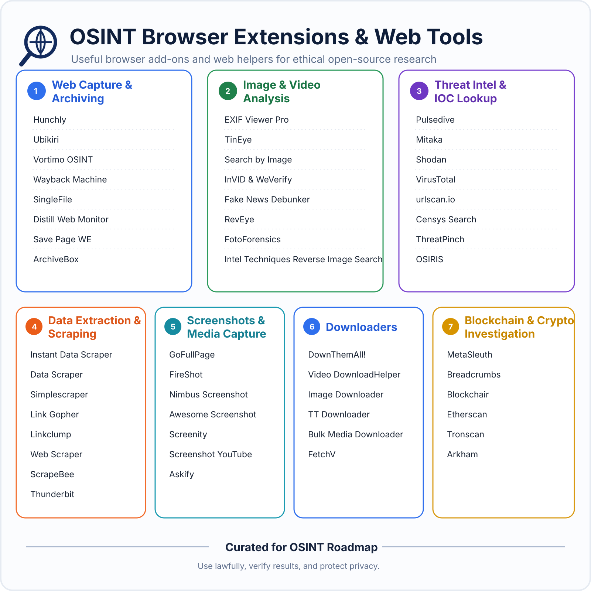

# 🕵️ OSINT Roadmap

<div align="center">

**A practical, method-first roadmap for learning Open Source Intelligence — from the first clue to a defensible intelligence assessment.**

[](https://github.com/imedkablavi/OSINT-Roadmap/stargazers)
[](https://github.com/imedkablavi/OSINT-Roadmap/network/members)
[](https://github.com/imedkablavi/OSINT-Roadmap/watchers)
[](https://github.com/imedkablavi/OSINT-Roadmap/graphs/contributors)
[](https://github.com/imedkablavi/OSINT-Roadmap/releases/latest)
[](LICENSE)

[](README.en.md)
[](#%F0%9F%98%95-dont-know-where-to-start)
[](#%F0%9F%94%90-scope-ethics-and-safe-use)

[](https://github.com/imedkablavi/OSINT-Roadmap/actions/workflows/link-check.yml)
[](https://github.com/imedkablavi/OSINT-Roadmap/actions/workflows/accessibility.yml)
[](https://github.com/imedkablavi/OSINT-Roadmap/actions/workflows/lighthouse.yml)
[](https://github.com/imedkablavi/OSINT-Roadmap/actions/workflows/tool-freshness.yml)

</div>

> **OSINT is not a race to collect the most information.**
> It is the discipline of asking a precise question, finding useful public signals, testing them, understanding their limits, and explaining what the evidence actually supports.

---

## 🧭 The Roadmap


The roadmap is deliberately **method-first**.

Tools disappear, change ownership, change pricing, add restrictions, or become unreliable. The core investigation cycle stays useful:

```text
FRAME
  ↓
DISCOVER
  ↓
VERIFY
  ↓
CORRELATE
  ↓
ASSESS
  ↓
REPORT
  ↓
SPECIALIZE
  ↓
REVIEW + TEACH
```

### 🧠 How to read the roadmap

Think of every investigation as four layers:

| Layer | The question you should ask |
| --- | --- |
| 🎯 **Question** | What exactly am I trying to determine? |
| 🔎 **Evidence** | What public sources could answer it? |
| 🧪 **Validation** | How can I challenge the first result? |
| 📝 **Assessment** | What can I responsibly conclude, and with what confidence? |

> [!IMPORTANT]
> **A search result is a lead, not automatically evidence. A tool output is a signal, not automatically proof.**

### 🧩 Resource legend

Use the symbols throughout the roadmap and resource library:

- 📘 — books and long-form references
- 🎞️ — courses, talks, and videos
- 📝 — articles, write-ups, and research notes
- 🔗 — tools, documentation, datasets, and websites
- 🧪 — practical labs and challenges
- 💎 — high-value reference material
- 👶 — beginner-friendly starting point
- 🔐 — privacy / OPSEC consideration
- ⚠️ — important limitation or caveat
- ✅ — verified / reviewed resource

---

## ❓ What is OSINT?

**Open Source Intelligence (OSINT)** is the structured collection, evaluation, analysis, and communication of information obtained from publicly accessible sources.

OSINT is broader than "searching Google". A useful practitioner should be able to:

- 🧠 frame an intelligence question before collecting data;
- 🔎 discover relevant public sources without drowning in noise;
- 🧬 trace information back to its origin and provenance;
- 🧪 corroborate important claims independently;
- 🕒 reconstruct timelines and resolve conflicting dates;
- 🧩 connect entities, identifiers, infrastructure, places, and events;
- 📊 distinguish observation from inference;
- 📐 calibrate confidence instead of forcing certainty;
- 📝 document sources so another researcher can reproduce the work;
- 🛑 stop when additional collection no longer adds analytical value.

This roadmap therefore treats OSINT as an **investigative discipline**, not a directory of websites.

---

## 🚀 Start Here

### 😕 Don't Know Where to Start?

Do **not** begin by trying to learn 100 tools.

Start with the clue you already have:

| You have… | Start with… |
| --- | --- |
| 🌐 A domain | [Domain investigation playbook](playbooks/README.md#i-have-a-domain) |
| 👤 A username | [Username investigation playbook](playbooks/README.md#i-have-a-username) |
| 📧 An email | [Email / public identity research](playbooks/README.md#i-have-a-username) |
| 📞 A phone number | [Phone investigation](playbooks/README.md#i-have-a-username) |
| 🖼️ An image | [Image investigation](playbooks/README.md#i-have-an-image) |
| 🎥 A video | [Video investigation](playbooks/README.md#i-have-a-video) |
| 🏢 A company name | [Company investigation](playbooks/README.md#i-have-a-company-name) |
| 🌍 A location claim | [Location investigation](playbooks/README.md#i-have-a-location-claim) |
| 📰 A news claim | [News claim verification](playbooks/README.md#i-have-a-news-claim) |
| 📄 A public document | [Document investigation](playbooks/README.md#i-have-a-public-document) |
| 🌐 An IP address | [IP / infrastructure investigation](playbooks/README.md#i-have-an-ip-address) |

> [!TIP]
> Start from the **question and clue**, then choose the smallest defensible toolchain. Running every available tool usually creates noise faster than it creates insight.

---

## 🛠️ Your Investigation Workspace

### 🔎 Search the roadmap

**[Open the full-content search →](https://imedkablavi.github.io/OSINT-Roadmap/search.html)**

Search the learning guides, playbooks, labs, glossaries, case studies, and multilingual documentation from one privacy-friendly static index.

### 🧰 Find the right tool

**[Open the OSINT Tool Finder →](https://imedkablavi.github.io/OSINT-Roadmap/tool-finder.html)**

The Tool Finder helps you work backwards from the clue:

```text
Domain • Username • Email • Phone • Image • IP
Organization • Location • Document • Aircraft • Vessel
Crypto Address • DOI • ORCID
```

Then refine by cost and skill level instead of selecting tools blindly.

### 🧱 Build a clue-first stack

**[Investigator Tool Stack →](tools/investigator-stack.md)**

Use this when you already know your input and need a compact workflow rather than another giant tools list.

### ✅ Browse verified open-source tools

**[Verified Open-Source Tool Subset →](tools/open-source-tools.md)**

See upstream source, license, practical role, limitations, and safe-use notes.

---

## 🗺️ Core Learning Path

### 🌱 Foundations

Before specialized tools, learn the habits that prevent weak investigations.

- 🎯 Intelligence questions and research scoping
- 🔎 Search operators and search strategy
- 🧬 Source provenance and source dependency
- 🧪 Corroboration and contradiction testing
- 🕒 Timeline construction
- 🧠 Entity resolution
- 📊 Confidence and uncertainty
- 📝 Evidence tables and source logs
- 🔐 Research-browser separation and OPSEC
- 🛑 Stop conditions

**[Research methods →](docs/research-methods.md)**  
**[Skill Matrix →](docs/skill-matrix.md)**  
**[Quick Reference / Cheat Sheet →](cheatsheets/osint-quick-reference.md)**

---

### 🔍 Discovery

Learn to turn a vague clue into a structured collection plan.

#### 🌐 Search, Archives & Public Web

- 🔗 Search engines and query design
- 🔗 Web archives and cached copies
- 🔗 Historical pages and change detection
- 🔗 Public datasets and repositories
- 🔗 Search-result source tracing

#### 👤 Identity & Digital Footprint

- 🔗 Username pivoting
- 🔗 Public email research
- 🔗 Public phone-number research
- 🔗 Stable identifiers
- 🔗 Alias and spelling variation
- 🔗 Attribution hypotheses

#### 🏢 Organizations & Public Records

- 🔗 Corporate entities
- 🔗 Ownership and relationships
- 🔗 Procurement and filings
- 🔗 Public legal and regulatory records
- 🔗 Organization timelines

---

### 🧪 Verification

Discovery creates leads. Verification decides what survives.

#### 🖼️ Image & Video Verification

- 🔎 Reverse image search
- 🧬 Provenance and source-chain analysis
- 🕒 Temporal consistency
- 📍 Geolocation clues
- 🎥 Video-frame verification
- ⚠️ Reposts, edits, cropping, and context loss

**[Browser Extensions & Web Tools →](tools/browser-extensions.md)**

#### 📰 Claims & News

- 🔎 Original-source tracing
- 🧩 Copied-source chain detection
- 🕒 Date and context validation
- 🗣️ Quote verification
- 🔗 Independent-source corroboration

#### 📍 GEOINT

- 🗺️ Maps and satellite imagery
- 🧭 Geolocation
- 🕒 Chronolocation
- 🏙️ Buildings, roads, terrain, signs, shadows
- 🧪 Candidate generation and rejection

**[Advanced GEOINT Challenge Ladder →](challenges/advanced-geoint.md)**

---

### 🧠 Correlation & Analysis

Once individual facts are verified, ask what happens when they are combined.

- 🧩 Entity resolution
- 🕸️ Relationship mapping
- 🕒 Timeline analysis
- 🗺️ Geographic correlation
- 🧮 Structured data cleanup
- 🔬 Competing hypotheses
- 📉 Confidence calibration
- ⚠️ Missing-data analysis
- 🧠 Alternative explanations

The goal is not to produce the most complicated graph. The goal is to produce the **most defensible explanation**.

---

### 📝 Reporting

A professional investigation should leave behind an understandable record.

A strong report should make it easy for another researcher to answer:

```text
What was the question?
What did you find?
Where did it come from?
How was it verified?
What remains uncertain?
What did you rule out?
What can you responsibly conclude?
```

**[Report Template →](docs/report-template.md)**

---

## 🎓 Professional Specialization

Once the core workflow is comfortable, choose a track instead of collecting random advanced tools.

| Track | Focus |
| --- | --- |
| 🛡️ [Cyber Threat Intelligence](tracks/cti.md) | PIRs, passive indicator enrichment, infrastructure relationships, ATT&CK mapping, timelines, attribution discipline |
| 👤 [Digital Footprint Investigation](tracks/digital-footprint.md) | public trace discovery, archives, stable identifiers, attribution, privacy minimization |
| 🏢 [Company Investigation](tracks/company-investigation.md) | legal entity resolution, filings, ownership, corporate timelines, sanctions checks, relationship mapping |
| 🗺️ [Advanced GEOINT Challenges](challenges/advanced-geoint.md) | geolocation and chronolocation through a structured challenge ladder |
| 📰 Journalism / Fact Checking | claim tracing, source independence, media provenance, correction discipline |
| 🌐 Public Web Infrastructure | domains, DNS, certificates, public infrastructure and passive enrichment |

**Arabic specialization hub:** [المسارات الاحترافية بالعربية](docs/ar/advanced-paths.md)  
**Turkish specialization hub:** [Türkçe profesyonel uzmanlaşma yolları](docs/tr/advanced-paths.md)

---

## 🧰 OSINT Tool Library

The project maintains a **curated library of 110+ tools and primary-source research resources** rather than an unreviewed link dump.

The library covers:

- 🔎 Search, archives, and monitoring
- 👤 Usernames, email, phone, and public identity clues
- 🖼️ Image and video verification
- 🗺️ GEOINT, maps, and satellite imagery
- 🌐 Domains, IPs, and internet infrastructure
- 🛡️ CTI and public IOC enrichment
- 🏢 Company, ownership, procurement, legal, and public records
- ✈️ Aviation, maritime, and rail research
- 📄 Document extraction and data cleanup
- 🕸️ Investigation workspaces, timelines, and relationship analysis
- ⛓️ Blockchain research
- 🎓 Academic and researcher metadata

Every category records the **input, cost, skill level, best use, and main limitation** of a resource. Tool records also carry review metadata so freshness can be maintained over time.

**[English Tool Library →](tools/tool-library.md)**  
**[مكتبة الأدوات بالعربية →](tools/tool-library.ar.md)**  
**[Türkçe Araç Kütüphanesi →](tools/tool-library.tr.md)**  
**[Tools Hub →](tools/README.md)**

---

## 🌐 Browser Extensions & Web Tools



Permissions matter.

A browser extension can see more than the page you are currently investigating, so a serious OSINT workflow should consider:

- 🔐 permissions;
- 🔐 account separation;
- 🔐 browser profiles;
- 🔐 research identity hygiene;
- ⚠️ third-party data handling;
- ⚠️ what the extension result does **not** prove.

**[English guide →](tools/browser-extensions.md)**  
**[الدليل العربي →](tools/browser-extensions.ar.md)**  
**[Türkçe rehber →](tools/browser-extensions.tr.md)**

---

## 🧪 Practice That Produces Evidence of Skill

Reading about a technique is not the same as being able to execute and defend it.

The project uses an artifact-based progression model:

```text
Read → Practice → Produce → Explain → Defend → Review
```

A useful artifact might be:

| Stage | Evidence of learning |
| --- | --- |
| 🌱 Foundations | Scoped research question + stop condition |
| 🔎 Discovery | Search/source collection plan |
| 🧪 Verification | Provenance table + independent corroboration |
| 🧠 Analysis | Competing-hypothesis table + confidence rationale |
| 📝 Reporting | Reproducible intelligence note |
| 🛡️ CTI | PIR-driven threat assessment |
| 👤 Digital Footprint | Privacy-minimized attribution assessment |
| 🏢 Company | Entity-resolution + corporate timeline |
| 🗺️ GEOINT | Geolocation report with rejected candidates |

**[Practice Labs →](docs/practice-labs.md)**  
**[Skill Matrix & Progress Tracker →](docs/skill-matrix.md)**  
**[Case Studies →](case-studies/README.md)**

---

## 🤖 AI-Assisted OSINT

AI can accelerate parts of the workflow, but it should not replace evidence.

### ✅ Good uses

- 🔎 Search-query variants
- 🌍 Transliteration and language discovery
- 🧩 Entity extraction from your own collected material
- 📝 Note organization
- 🧠 Alternative-hypothesis generation
- 🧹 Structured-data cleanup

### ⚠️ Bad mental model

```text
AI says it → therefore it is true
```

### ✅ Better mental model

```text
AI suggests a lead
       ↓
You inspect the underlying source
       ↓
You verify independently
       ↓
You document what is actually supported
```

> [!CAUTION]
> Names, dates, quotations, relationships, URLs, and conclusions should still be checked against the underlying public sources.

---

## 🔐 Scope, Ethics & Safe Use

This roadmap focuses on **lawful public-source research**.

It does not teach:

- unauthorized access;
- credential attacks;
- account takeover;
- access-control bypass;
- deceptive social engineering;
- stalking or harassment;
- doxxing;
- intrusive scanning without authorization.

### 🛑 The stop rule

```text
If the next step requires intrusion,
deception, private access,
or bypassing a security restriction:
STOP.
```

Good OSINT respects **privacy, proportionality, consent, source context, and the limits of public information**.

---

## 🔄 Tool Radar & Continuous Maintenance

The OSINT landscape moves quickly.

Tools can change:

```text
ownership
pricing
permissions
availability
interfaces
capabilities
terms of use
```

That is why the project maintains a review loop instead of treating a URL that still returns `200` as proof that the information is current.

**[OSINT Tool Radar →](updates/2026-08-tool-radar.md)**  
**[Updates Archive →](updates/README.md)**  
**RSS:** `https://imedkablavi.github.io/OSINT-Roadmap/feed.xml`

The repository also runs automated checks for link health and review freshness so stale resources can be detected independently of broken URLs.

---

## 🌍 Learn in Your Language

### 🇬🇧 English

**[Open the English Roadmap →](README.en.md)**

Core material:

- [Research methods](docs/research-methods.md)
- [Tool matrix](docs/tool-matrix.md)
- [Curated OSINT Tool Library](tools/tool-library.md)
- [Investigator tool stack](tools/investigator-stack.md)
- [Practice labs](docs/practice-labs.md)
- [Browser extensions & web tools](tools/browser-extensions.md)
- [Report template](docs/report-template.md)
- [English glossary](glossary/README.en.md)

### 🇸🇦 العربية

**[افتح خارطة الطريق العربية →](README.ar.md)**

- [مركز التعلم العربي](docs/ar/README.md)
- [مكتبة أدوات OSINT بالعربية](tools/tool-library.ar.md)
- [حزمة أدوات الباحث](tools/investigator-stack.ar.md)
- [إضافات المتصفح وأدوات الويب](tools/browser-extensions.ar.md)
- [المسارات الاحترافية بالعربية](docs/ar/advanced-paths.md)
- [قاموس OSINT بالعربية](glossary/README.ar.md)

### 🇹🇷 Türkçe

**[Türkçe OSINT Yol Haritasını Aç →](README.tr.md)**

- [Türkçe öğrenme merkezi](docs/tr/README.md)
- [Türkçe OSINT Araç Kütüphanesi](tools/tool-library.tr.md)
- [Araştırmacı araç seti](tools/investigator-stack.tr.md)
- [Tarayıcı eklentileri & web araçları](tools/browser-extensions.tr.md)
- [Profesyonel uzmanlaşma yolları](docs/tr/advanced-paths.md)
- [Türkçe OSINT sözlüğü](glossary/README.tr.md)

---

## 📌 Field Reference

Need a fast reminder while working?

**[OSINT Quick Reference / Cheat Sheet →](cheatsheets/osint-quick-reference.md)**

It covers:

- search patterns;
- source verification;
- image/video checks;
- username attribution;
- passive domain research;
- company research;
- timelines;
- confidence language;
- evidence tables;
- reporting;
- stop rules.

---

## 🧠 What Makes This Roadmap Different?

A large tools list can help you discover websites.

A useful roadmap should help you **think**.

This project emphasizes:

> 🎯 **Question before collection**  
> 🔎 **Discovery before assumptions**  
> 🧪 **Verification before attribution**  
> 🧩 **Correlation before conclusions**  
> 📐 **Confidence before certainty**  
> 📝 **Documentation before memory**  
> 🔐 **Privacy before convenience**

```text
Finding information is discovery.

Proving what it means is investigation.
```

---

## 📖 Project Documentation

For maintainers, contributors, and advanced users:

- 🧭 [Visual roadmap](docs/visual-roadmap.md)
- 🧪 [Practice labs](docs/practice-labs.md)
- 📊 [Skill matrix](docs/skill-matrix.md)
- 🧰 [Tool matrix](docs/tool-matrix.md)
- 📝 [Report template](docs/report-template.md)
- 📚 [Case studies](case-studies/README.md)
- 🗂️ [Tools hub](tools/README.md)
- 🤝 [Contributing guide](CONTRIBUTING.md)
- 📝 [Changelog](CHANGELOG.md)
- 📜 [Citation](CITATION.cff)

---

## 🤝 Contributing

Good research resources become much more valuable when the community keeps them accurate.

You can contribute by:

- 🔗 fixing a broken or outdated resource;
- 🧰 adding or reviewing an OSINT tool;
- 🧪 creating a safe practice lab;
- 📝 improving methodology;
- 🌍 improving English, Arabic, or Turkish translations;
- 🗺️ adding a better visualization;
- 🔎 documenting verification methods;
- ⚠️ clarifying what a tool can and cannot prove.

**[Read CONTRIBUTING.md →](CONTRIBUTING.md)**

> [!TIP]
> A contribution does not have to be large. One correctly verified source, one better explanation, or one fixed translation can make the roadmap more useful for the next researcher.

---

## 📜 History

The project is intentionally evolving from a static roadmap into a maintained OSINT learning and research reference.

Its structure has grown around a simple principle:

```text
Tools change quickly.
Methods should age slowly.
Evidence should remain explainable.
```

The current repository combines the roadmap with multilingual learning material, a curated tool library, investigation playbooks, practical challenges, case studies, search, and automated quality checks.

---

## 📜 License

MIT License © Imed Kablavi

---

<div align="center">

**🕵️ Learn the method. 🔎 Find the signal. 🧪 Verify the claim. 📝 Explain the evidence.**

</div>
