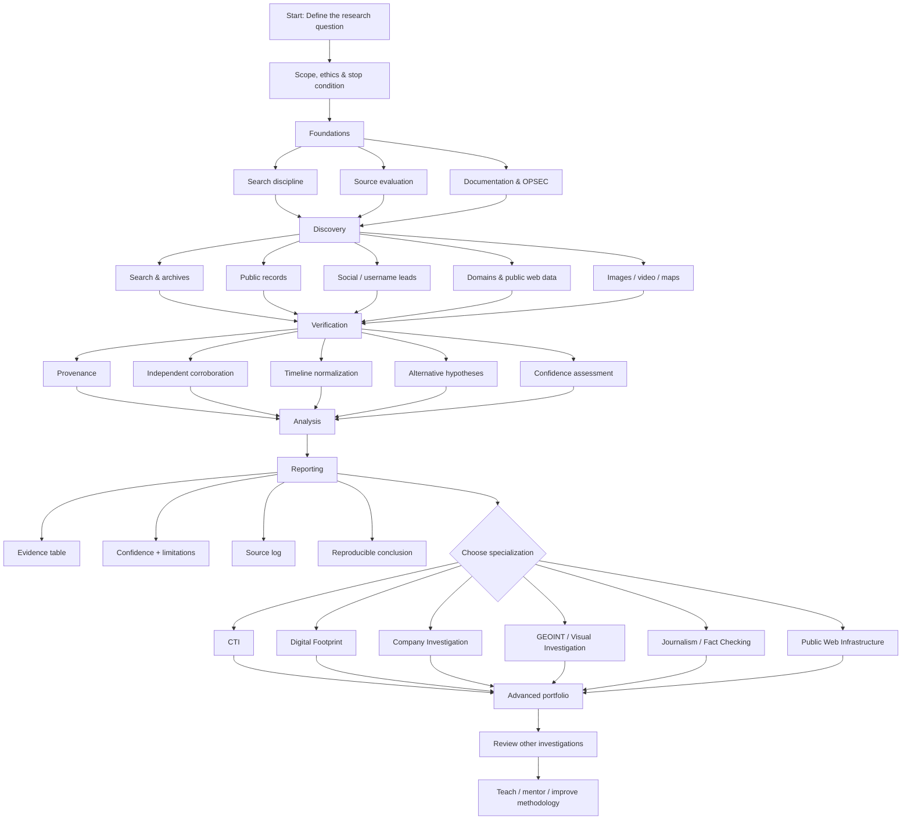

# Visual OSINT Roadmap

This diagram is intentionally method-first. Tools change; the investigation cycle should remain understandable.



## Learning sequence

```text
FOUNDATIONS
    ↓
DISCOVERY
    ↓
VERIFICATION
    ↓
ANALYSIS
    ↓
REPORTING
    ↓
SPECIALIZATION
    ↓
PORTFOLIO + REVIEW
```

## What “complete” means

A stage is not complete because you know the tool names.

It is complete when you can produce an artifact:

| Stage | Evidence of learning |
| --- | --- |
| Foundations | scoped research question + stop condition |
| Discovery | documented search/source collection plan |
| Verification | provenance table + independent corroboration |
| Analysis | competing-hypothesis table + confidence rationale |
| Reporting | reproducible intelligence note |
| CTI | PIR-driven threat assessment |
| Digital Footprint | privacy-minimized attribution assessment |
| Company | entity-resolution + corporate timeline |
| GEOINT | geolocation report with rejected candidates |

Use the [Skill Matrix](skill-matrix.md) to track progress.
